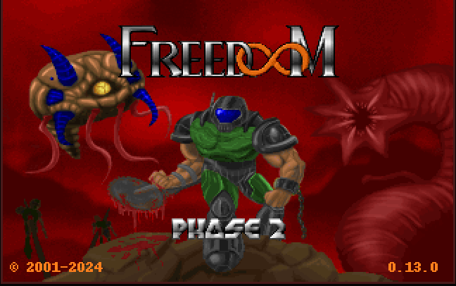
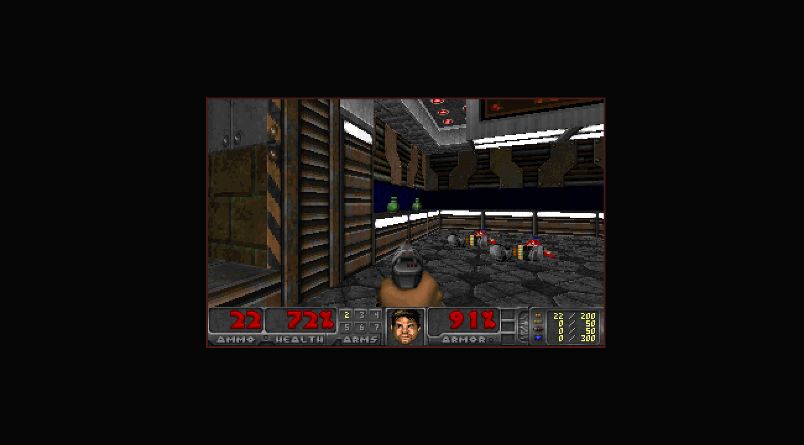
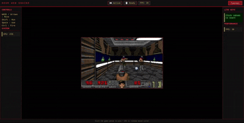

<div align="center">

# 🎮 DOOM Game Engine

### A Modern Web-Based DOOM Engine Powered by WebAssembly


A browser-based DOOM engine that delivers the classic FPS experience directly inside modern web browsers using JavaScript, HTML5 Canvas, WebAssembly, and Node.js.

</div>

---

# 📖 Overview

This project recreates the classic DOOM gameplay experience inside a web browser without requiring native installation.

The engine loads the FreeDoom WAD, initializes the WebAssembly runtime, renders graphics using HTML5 Canvas, processes keyboard controls, and streams audio in real time.

It demonstrates how legacy native game engines can be deployed as modern browser applications.

---

# ✨ Features

- 🎮 Browser-based DOOM gameplay
- ⚡ WebAssembly game engine
- 📦 FreeDoom WAD support
- 🖥 Fullscreen gameplay
- 🎵 Audio playback
- 🎯 Keyboard controls
- 🚀 Lightweight Express server
- 🌐 Cross-platform
- 📱 Responsive interface
- 🔥 Fast loading
- 📂 Easy project structure
- 🔧 Easy customization

---

# 🎥 Gameplay Demo

<p align="center">

<a href="docs/DOOM01.mp4">


</a>

</p>

> Click the image above to watch the gameplay video.

---

# 📸 Screenshots

## Main Menu

<p align="center">

</p>

---

## Gameplay

<p align="center">

</p>

---

## Fullscreen Mode

<p align="center">

</p>

---

## Animation Preview

<p align="center">

</p>

---

# 🏗 Architecture

```
                Browser

                    │

        HTML / CSS / JavaScript

                    │

             WebAssembly Engine

                    │

          FreeDoom WAD Resources

                    │

           Audio + Graphics Engine

                    │

            HTML5 Canvas Rendering
```

---

# 📂 Project Structure

```text
DOOM
│
├── docs/
│   ├── DOOM01.mp4
│   ├── DOOM01.gif
│   ├── DOOM02.png
│   ├── DOOM03.png
│   ├── DOOM04.png
│   └── DOOM05.png
│
├── public/
│   ├── engine/
│   ├── game/
│   ├── index.html
│   ├── app.js
│   ├── sound.js
│   └── style.css
│
├── package.json
├── server.js
└── README.md
```

---

# ⚙ Installation

Clone the repository

```bash
git clone https://github.com/sayan08880/DOOM-GAME-ENGINE.git
```

Open the project

```bash
cd DOOM-GAME-ENGINE
```

Install dependencies

```bash
npm install
```

Start the server

```bash
npm start
```

Open

```
http://localhost:3000
```

---

# 🎮 Controls

| Key | Action |
|------|--------|
| W | Move Forward |
| A | Turn Left |
| S | Move Backward |
| D | Turn Right |
| Ctrl | Fire |
| Space | Open Door |
| Shift | Run |
| Arrow Keys | Navigation |

---

# 🛠 Technology Stack

| Technology | Purpose |
|------------|----------|
| HTML5 | User Interface |
| CSS3 | Styling |
| JavaScript | Client Logic |
| Node.js | Backend Server |
| Express.js | HTTP Server |
| WebAssembly | Game Engine |
| FreeDoom | Game Assets |

---

# 🚀 Performance

- Fast startup
- Lightweight server
- Browser rendering
- Cross-platform support
- Responsive controls
- Optimized asset loading

---

# 🛣 Roadmap

- Multiplayer
- Save Games
- Touch Controls
- Gamepad Support
- Graphics Settings
- Sound Settings
- Custom Maps
- Mod Loader
- Multiplayer Lobby

---

# 🤝 Contributing

Contributions are welcome.

1. Fork the repository
2. Create a feature branch
3. Commit your changes
4. Push your branch
5. Open a Pull Request

---

# 📄 License

This project uses **FreeDoom** assets released under the BSD License.

---

# 👨‍💻 Author

**Sayan Mahalanabish**

GitHub

https://github.com/sayan08880

---

<div align="center">

### ⭐ If you like this project, consider giving it a Star ⭐

Made with ❤️ using JavaScript, Node.js and WebAssembly.

</div>
