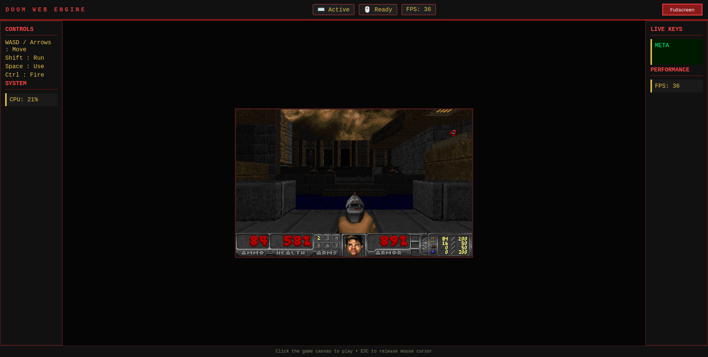
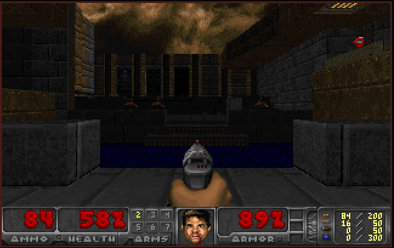

# 🎮 DOOM Game Engine

> A lightweight web-based DOOM engine that runs directly in the browser using WebAssembly and JavaScript.



---

## ✨ Features

- 🎮 Play DOOM directly in a web browser
- ⚡ Powered by WebAssembly (WASM)
- 📦 Uses the FreeDoom WAD
- 🔊 Audio support
- 🖥️ Responsive fullscreen game canvas
- 🚀 Lightweight Node.js server
- 📂 Easy to customize and extend

---

## 📸 Screenshots

### Game Screen



### Gameplay


### Fullscreen Mode


---

## 🏗️ Project Structure

```text
DOOM/
├── public/
│   ├── engine/
│   │   └── doom.wasm
│   ├── game/
│   │   └── freedoom2.wad
│   ├── app.js
│   ├── sound.js
│   ├── style.css
│   └── index.html
├── server.js
├── package.json
└── README.md
```

---

## 🚀 Getting Started

### Clone Repository

```bash
git clone https://github.com/sayan08880/DOOM-GAME-ENGINE.git
cd DOOM-GAME-ENGINE
```

### Install Dependencies

```bash
npm install
```

### Start Server

```bash
node server.js
```

or

```bash
npm start
```

---

## 🌐 Open in Browser

```
http://localhost:3000
```

---

## 🎮 Controls

| Key | Action |
|------|--------|
| W | Move Forward |
| S | Move Backward |
| A | Turn Left |
| D | Turn Right |
| Arrow Keys | Movement |
| Ctrl | Fire |
| Space | Open Door / Use |
| Shift | Run |

---

## 🛠️ Technologies Used

- HTML5
- CSS3
- JavaScript
- Node.js
- Express.js
- WebAssembly
- FreeDoom

---

## 📦 Requirements

- Node.js 18+
- Modern Browser
- npm

---

## ⚙️ Future Improvements

- Multiplayer Support
- Save/Load Games
- Mobile Controls
- Custom Maps
- Mod Loader
- FPS Counter
- Settings Menu
- Gamepad Support

---

## 📄 License

This project uses **FreeDoom** assets.

FreeDoom is distributed under the BSD license.

---

## 👨‍💻 Author

**Sayan Mahalanabish**

GitHub:
https://github.com/sayan08880

---

## ⭐ Support

If you like this project,

⭐ Star the repository

🍴 Fork the repository

🐞 Report bugs

💡 Suggest new features
